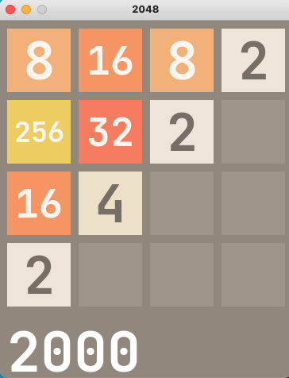

# Playing 2048 using reinforcement learning

**Run `python play.py` to start a 2048 game**

* Press arrow `up, down, left, right` to control blocks moves, just like the ordinary 2048 game. 

* Press `Enter` to ask for one step move from AI agent.

* Press `a`  to ask AI agent to take over the whole game until it ends.

* Press `r` to restart the whole game

This repo refers to [dqn2048](https://github.com/QYHcrossover/dqn2048)
