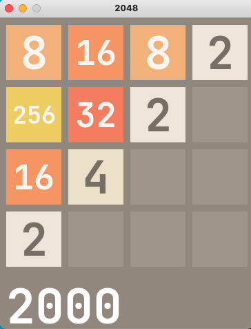
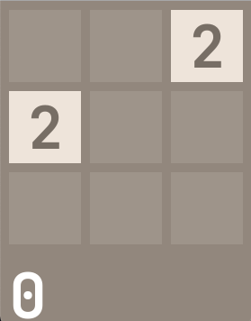
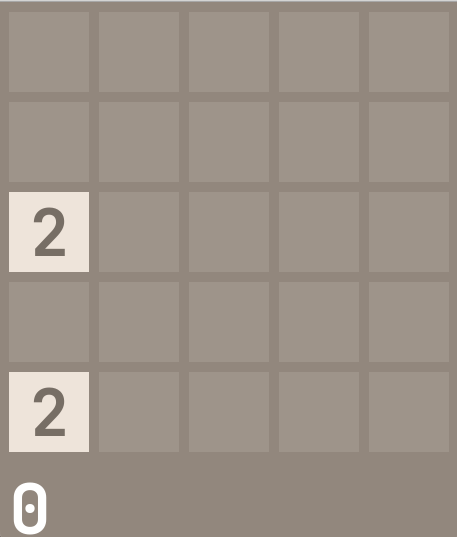

# Playing 2048 using reinforcement learning

**Run `python play4.py` to start a 4X4 2048 game**

* Press arrow `up, down, left, right` to control blocks moves, just like the ordinary 2048 game. 

* Press `Enter` to ask for one step move from AI agent.

* Press `a`  to ask AI agent to take over the whole game until it ends.

* Press `r` to restart the whole game

*NOTE*

* run `python play3.py` to start a 3X3 2048 game

* run `python play5.py` to start a 5X5 2048 game

If AI agent takes over the game from the beginning, you will achieve:

* 512 for 4X4
* 2048 for 5X5
* 64 for 3X3

This repo refers to [dqn2048](https://github.com/QYHcrossover/dqn2048)
